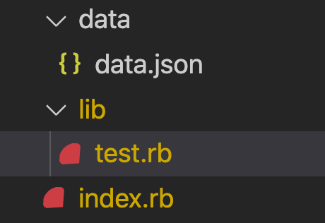

# Ruby File Reading and Writing

Reading and writing to files in ruby is something that can be done using the [ File class ](https://ruby-doc.org/core-2.7.2/File.html) that is in built into ruby.

## File read

The easiest way to read files in ruby is using the `read` method.
e.g.

```ruby
File.read('test.txt')
```

It takes one string as argument this string being the file location of the file. So if you had a file structure in this format:



To access the `data.json` from `index.rb` the file path will be `./data/data.json`. Similarly if you were to try to access the `data.json` from `test.rb` the file path is `../data/data.json`.

NOTE: This changes with using classes and using index.rb as the entry point of an app. Because index.rb is the entry point when loading a file in a class that is instantiated in the index.rb the file path will have to be the one `./data/data.json`.

If this is confusing just make sure to use `./data/data.json` as your file path.

## File types

Probably the most basic format you might want to store your data is by using a text file this is ok but generally you want to use a file type that actually lets you retain some kind of format of your data. The some great file formats to use is json, csv and yaml. I will run through how I would use json to create persistent storage here but feel to give csv or yaml a go on your own.

##  File writing

Before we get into json lets quickly talk about how to write to a file. The simplest and possible best way to do this in Ruby is using `File.write`.
e.g

```ruby

File.write('test.txt',data)

```

`File.write` usually takes two arguments, file location and the data to be written to the file. Keep in mind it will take whatever data you input to it and write it as is. For example.

```ruby

data = [1,2,3,4]

File.write('test.txt',data)

# This will write [1,2,3,4] as plain text to test.txt.

```

Keep in mind that writing this way will completely overwrite everything in that file. If you want to simply add to the file you can pass a third named argument to the write method. Like this:

```ruby

File.write('test.txt',data, mode: 'a')

```

The mode argument lets you change mode of write in this case to append which will append the data to the file rather than overwrite everything in the file.

In most cases I would not use append however and simple work with reading the data in manipulating it in my app and then rewriting the file with the new data.

# JSON

Json stands for JavaScript Object Notation and is a format of holding that has been increasingly popular particularly when dealing web development. You will see this used much more later and may have already seen it being the primary type of data returned from APIs.

JSON format is very similar to Ruby hashes and array with some key differences. While in ruby it is common to have symbols as your key value in a hash in JSON objects the key will most likely be strings. Here is an example of a JSON object

```json
[
  {
    "name":"Test",
    "age":25,
    "occupation":"Robot"
  },
  {
    "name":"Test 2",
    "age":20,
    "occupation":"Android"
  }
]
```

## Using JSON in ruby

So Ruby has a JSON library in built in order to handle json data. To use it we will need to require it in at the top of our file.
```ruby

require 'json'

```

### Converting from JSON

We are now gonna be using JSON as our main persistent file storage
